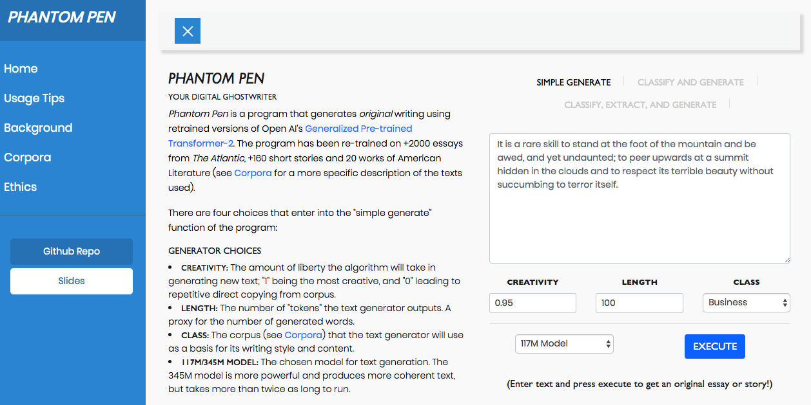

# Phantom Pen - Web Application 

[This repository is under construction]

These files contain the code for the Flask web application Phantom Pen. The model training (for GPT-2), web-scraping, and data cleaning codes are not included in this repository

### Code Files

What things you need to install the software and how to install them

There are many categories of code files:

* Code used to train the various models
* Code used to scrape text and concatenate into a single file
* Code for text classification and extractive summary
* Code to collect metadata of the corpora
* Code for Flask application
  * HTML/CSS/Image Files 
  * Python File of application

## Authors

* **Mobolaji Williams** - *Initial work* - [mowillia](https://github.com/mowillia)

## Acknowledgments

* [NSheppherd](https://github.com/nshepperd) for code for training
* [OpenAI](https://github.com/openai) for pretrained model
