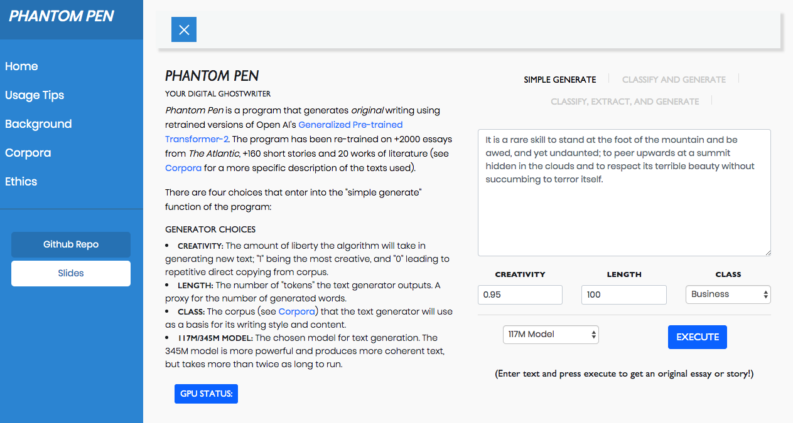

# Phantom Pen - Web Application 

These files contain the code for the Flask web application Phantom Pen. The model training (for GPT-2), web-scraping, and data cleaning codes are not included in this repository

### Code Files

The code files have the following functions

* Text Files: Files for various corpora
  * `gutenberg_texts`
  * `short_stories`
  * `Atlantic_subj_essays`
  * `concatenated_subj_files`
* Training Code
  * `train.py` Slightly modified version of Nsheppherd's GPT2 training code
  * `gpt2_training_clean.ipynb` Code used to train the various models for the program
* Scraping texts and concatenating
  * `web_scraping_atlantic_subjs.py` Code used to scrape atlantic articles
  * `web_scraping_short_stories.py` Code used to scrape short stories
  * `essay_concatenation_clean.py` Code used to concatenate the articles, short stories, books
* Text generation and classification
  * `text_generation_function.ipynb` Code for the simple generate, classify & generate, and classify, extract, & generate functions of the application
  * `classification_comparison.ipynb` Comparison of various classifiers for the classify function
* `extractive_text_summarizer` folder: Code for explored extractive summarization implementations
  * `text_summarizer_1_word_ct_cos_sim.ipynb`: Extractive summary using word-count vectors and cosing similarity [Ultimately the chosen one]
  * `text_summarizer_2_word_freq.ipynb`: Extractive summary using word-frequency vectors
  * `text_summarizer_3_word_embed.ipynb`: Extractive summary using word embeddings  
* `writrly` folder: Code for Flask application
  * HTML/CSS/Image Files 
  * Python File of application
* Additional Code for Flask application
  * needed for sample generation
    * `encoder.py`: needed to encode words
    * `sample.py`: needed to sample words randomly
    * `model.py`: contains the definition of the model
  * To run application
    * `run.py`
* Misc Files
  * `recurrent_neural_network_atlantic.ipynb`: Implementation of LSTM RNN to generate words for `Atlantic Education`

## Authors

* **Mobolaji Williams** - [mowillia](https://github.com/mowillia)

## Acknowledgments

* [NSheppherd](https://github.com/nshepperd) for code for training
* [OpenAI](https://github.com/openai) for pretrained model
